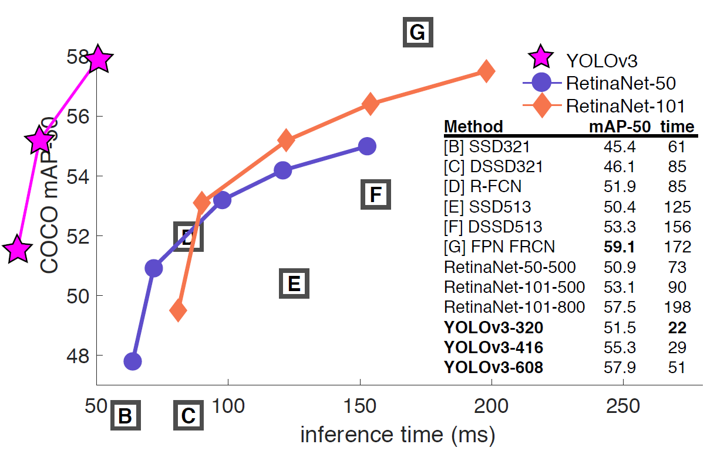

# pytorch-Yolov3
## A PyTorch implementation of Yolov3
This is a PyTorch implementation of the paper [YOLOv3: An Incremental Improvement](https://arxiv.org/pdf/1804.02767.pdf) by Joseph Redmon, Ali Farhadi. The official implementation is available in the [YOLO: Real-Time Object Detection](https://pjreddie.com/darknet/yolo/).


## Installation
##### Environment
* pytorch >= 0.4.0
* python >= 3.6.0
##### Download [VOC dataset](http://host.robots.ox.ac.uk/pascal/VOC/voc2012/VOCtrainval_11-May-2012.tar)

## Training
##### Start training
Modify config/config.py as your configuration.
```
python training.py
```

## Reference
* [darknet](https://github.com/pjreddie/darknet)
* [PyTorch-YOLOv3](https://github.com/eriklindernoren/PyTorch-YOLOv3): Thanks for Evaluate and YOLO loss code
